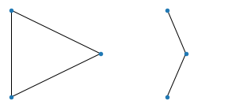
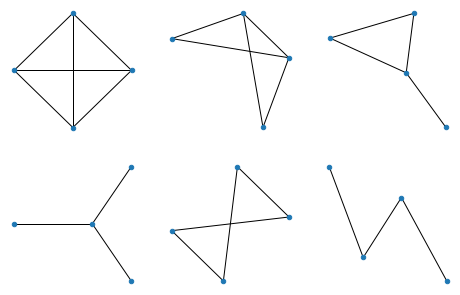
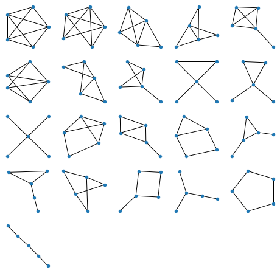
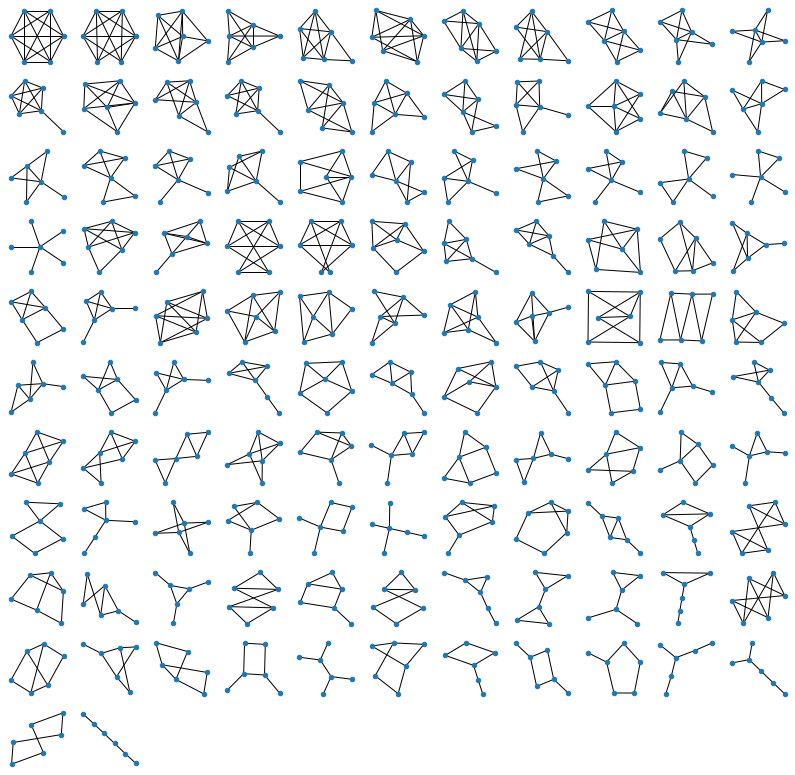
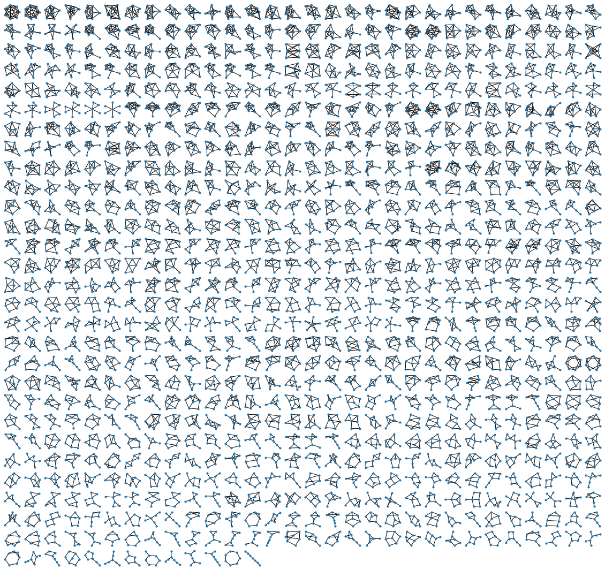

The other day I was homeschooling my kids, and they asked me: "Daddy, can you draw us all possible non-isomorphic graphs of 3 nodes"? Or maybe I asked them that? Either way, we happily draw all possible graphs of 3 nodes, but already for 4 nodes it got hard, and for 5 nodes - [plain impossible](https://www.graphclasses.org/smallgraphs.html#nodes5)!

So I thought: let me try to write a brute-force program to do it! I spent a few hours sketching some smart dynamic programming solution to generate these graphs, and went nowhere, as apparently the [problem is quite hard](http://www.cs.columbia.edu/~cs4205/files/CM9.pdf). I gave up, and decided to go with a naive approach:

1. Generate all graphs of N nodes, even if some of them look the same (are isomorphic). For \\(N\\) nodes, there are \\(\\frac{N(N-1)}{2}\\) potential edges to connect these nodes, so it's like generating a bunch of binary numbers. Simple!
2. Write a program to tell if two graphs are isomorphic, then remove all duplicates, unworthy of being presented in the final picture.

This strategy seemed more reasonable, but writing a "graph-comparator" still felt like a cumbersome task, and more importantly, this part would itself be slow, as I'd still have to go through a whole tree of options for every graph comparison. So after some more head-scratching, I decided to simplify it even further, and use the fact that these days the memory is cheap:

1. Generate all possible graphs (some of them totally isomorphic, meaning that they would look as a repetition if plotted on a figure)
2. For each graph, generate its "description" (like an [adjacency matrix](https://en.wikipedia.org/wiki/Adjacency_matrix), or an edge list), and check if a graph with this description is already on the list. If yes, skip it, we got its portrait already!
3. If however the graph is unique, include it in the picture, and also generate all possible "descriptions" of it, up to node permutation, and add them to the hash table. To make sure no other graph of this particular shape would ever be included in our pretty picture again.

For the first task, I went with the edge list, which made the task identical to [generating all binary numbers](https://www.geeksforgeeks.org/generate-all-the-binary-strings-of-n-bits/) of length \\(\\frac{N(N-1)}{2}\\) with a recursive function, except instead of writing zeroes you skip edges, and instead of writing ones, you include them. Below is the function that does the trick, and has an additional bonus of listing all edges in a neat orderly way. For every edge \\(i \rightarrow j\\) we can be sure that \\(i\\) is lower than \\(j\\), and also that edges are sorted as words in a dictionary. Which is good, as it restricts the set of possible descriptions a bit, which will simplify our life later.

```python
def make_graphs(n=2, i=None, j=None):
    """Make a graph recursively, by either including, or skipping each edge.
    Edges are given in lexicographical order by construction."""
    out = []
    if i is None: # First call
        out  = [[(0,1)]+r for r in make_graphs(n=n, i=0, j=1)]
    elif j<n-1:
        out += [[(i,j+1)]+r for r in make_graphs(n=n, i=i, j=j+1)]
        out += [          r for r in make_graphs(n=n, i=i, j=j+1)]
    elif i<n-1:
        out = make_graphs(n=n, i=i+1, j=i+1)
    else:
        out = [[]]
    return out
```

If you run this function for a small number of nodes (say, \\(N=3\\)), you can see how it generates all possible graph topologies, but that some of the descriptions would actually lead to identical pictures, if drawn (graphs 2 and 3 in the list below).

```
[(0, 1), (0, 2), (1, 2)]
[(0, 1), (0, 2)]
[(0, 1), (1, 2)]
[(0, 1)]
```

Also, while building a graph from edges means that we'll never get lonely unconnected points, we can get graphs that are smaller than \\(n\\) nodes (the last graph in the list above), or graphs that have unconnected parts. It is impossible for \\(n=3\\), but starting with \\(n=4\\) we would get things like `[(0,1), (2,3)]`, which is technically a graph, but you cannot exactly wear it as a piece of jewelry, as it would fall apart. So at this point I decided to only visualize fully connected graphs of exactly \\(n\\) vertices.

To continue with the plan, we now need to make a function that for every graph would generate a family of its "alternative representations" (given the constraints of our generator), to make sure duplicates would not slip under the radar. First we need a permutation function, to permute the nodes (you could also use a built-in function in `numpy`, but coding this one from scratch is always fun, isn't it?). Here's the permutation generator:

```python
def perm(n, s=None):
    """All permutations of n elements."""
    if s is None: return perm(n, tuple(range(n)))
    if not s: return [[]]
    return [[i]+p for i in s for p in perm(n, tuple([k for k in s if k!=i]))]
```

Now, for any given graph description, we can permute its nodes, sort the \\(i,j\\) within each edge, sort the edges themselves, remove duplicate alt-descriptions, and remember the list of potential impostors:

```python
def permute(g, n):
    """Create a set of all possible isomorphic codes for a graph,
    as nice hashable tuples. All edges are i<j, and sorted lexicographically."""
    ps = perm(n)
    out = set([])
    for p in ps:
        out.add(tuple(sorted([(p[i],p[j]) if p[i]<p[j]
                              else (p[j],p[i]) for i,j in g])))
    return list(out)
```

 Say, for an input description of `[(0, 1), (0, 2)]`, the function above returns three "synonyms":

```
((0, 1), (1, 2))
((0, 1), (0, 2))
((0, 2), (1, 2))
```

I suspect there should be a neater way to code that, to avoid using the `list → set → list` pipeline to get rid of duplicates, but hey, it works!

At this point, the only thing that's missing is the function to check whether the graph comes in one piece, which happens to be a famous and neat algorithm called the "[Union-Find](https://en.wikipedia.org/wiki/Disjoint-set_data_structure)". I won't describe it here in detail, but in short, it goes though all edges and connects nodes to each other in a special way; then counts how many separate connected components (like, chunks of the graph) remain in the end. If all nodes are in one chunk, we like it. If not, I don't want to see it in my pictures!

```python
def connected(g):
    """Check if the graph is fully connected, with Union-Find."""
    nodes = set([i for e in g for i in e])
    roots = {node: node for node in nodes}

    def _root(node, depth=0):
        if node==roots[node]: return (node, depth)
        else: return _root(roots[node], depth+1)

    for i,j in g:
        ri,di = _root(i)
        rj,dj = _root(j)
        if ri==rj: continue
        if di<=dj: roots[ri] = rj
        else:      roots[rj] = ri
    return len(set([_root(node)[0] for node in nodes]))==1
```

Now we can finally generate the "overkill" list of graphs, filter it, and plot the pics:

```python
def filter(gs, target_nv):
    """Filter all improper graphs: those with not enough nodes,
    those not fully connected, and those isomorphic to previously considered."""
    mem = set({})
    gs2 = []
    for g in gs:
        nv = len(set([i for e in g for i in e]))
        if nv != target_nv:
            continue
        if not connected(g):
            continue
        if tuple(g) not in mem:
            gs2.append(g)
            mem |= set(permute(g, target_nv))
    return gs2

# Main body
NV = 6
gs = make_graphs(NV)
gs = filter(gs, NV)
plot_graphs(gs, figsize=14, dotsize=20)
```

For plotting the graphs I wrote a small wrapper for the MatPlotLib-based NetworkX visualizer, splitting the figure into lots of tiny little facets using Matplotlib `subplot` command. "Kamada-Kawai" layout below is a [popular and fast version of a spring-based layout](https://en.wikipedia.org/wiki/Force-directed_graph_drawing), that makes the graphs look really nice.

```python
def plot_graphs(graphs, figsize=14, dotsize=20):
    """Utility to plot a lot of graphs from an array of graphs.
    Each graphs is a list of edges; each edge is a tuple."""
    n = len(graphs)
    fig = plt.figure(figsize=(figsize,figsize))
    fig.patch.set_facecolor('white') # To make copying possible (white background)
    k = int(np.sqrt(n))
    for i in range(n):
        plt.subplot(k+1,k+1,i+1)
        g = nx.Graph() # Generate a Networkx object
        for e in graphs[i]:            
            g.add_edge(e[0],e[1])
        nx.draw_kamada_kawai(g, node_size=dotsize)
        print('.', end='')
```

Here are the results. To build the anticipation, let's start with something trivial: all graphs of 3 nodes:



All graphs of 4 nodes:



All graphs of 5 nodes:



Generating figures above is of course all instantaneous on a decent computer, but for 6 nodes (below) it takes a few seconds:



For 7 nodes (below) it takes about 5-10 minutes. It's easy to see why: the brute-force approach generates all \\(2^{\frac{n(n-1)}{2}}\\) possible graphs, which means that the number of operations grows exponentially! Every increase of \\(n\\) by one, gives us \\(n-1\\) new edges to consider, which means that the time to run the program increases by \\(~2^{n-1}\\). For \\(n=7\\) it brought me from seconds to minutes, for \\(n=8\\) it would have shifted me from minutes to hours, and for \\(n=9\\), from hours, to months of computation. Isn't it fun? We are all specialists in exponential growth these days, so here you are :)



The code is available as a [Jupyter Notebook on my GitHub](https://github.com/khakhalin/Sketches/blob/master/classic/generate_all_graphs.ipynb). I hope you enjoyed the pictures, and the read! Which of those charms above would bring most luck? Which ones seem best for divination? Let me know what you think! :)

Contact me via [Twitter](https://twitter.com/ampanmdagaba) or [Github](https://github.com/khakhalin).
